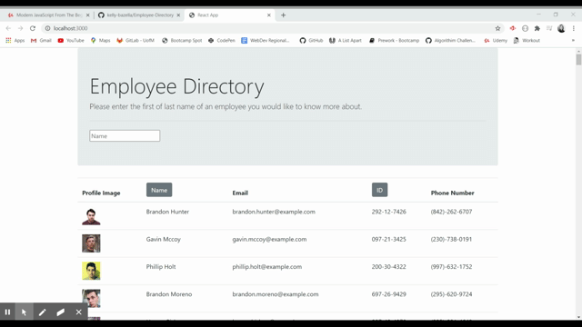

### Employee Directory

## Purpose

The purpose of this application is to sort employee data in an efficient manner. The user is presented with a list of employee data, they can choose to search the employee by name or sort the employee's by clicking the column title. 

The application is created with React and is broken into components, component state, and responds to user events. 

## User Story

As a user, I want to be able to view my entire employee directory at once so that I have quick access to their information.

## Links
GitHub repository: (https://github.com/kelly-bazella/Employee-Directory)

Heroku Link: (https://bazella-employee-tracker.herokuapp.com/)

## Criteria

1. Sort the employee directory by one catagory
2. Filter the users by one property

## Business Context 
An employee or manager would benefit greatly from being able to view non-sensitive data about other employees. It would be particularly helpful to be able to filter employees by name.

## Languages Used

- JavaScript
- HTML

## GIF

